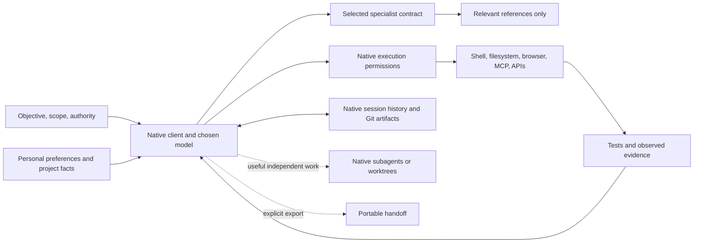

# Harness architecture

The model chooses the strategy. The native client runs tools, enforces execution
permissions and preserves sessions. This repository contributes specialist
contracts, a short optional preference file, two installers and local checks.
It contains no agent loop, scheduler, model router, database or MCP server.

## Context lifecycle

The layers have different lifetimes:

1. **Personal invariants:** optional [shared/AGENTS.md](shared/AGENTS.md), linked
   by the client-specific instruction paths. It records authority, preservation
   of unrelated work, coding preferences, completion and truthful applied/prepared
   status. It also preserves explicit shipping authority and required Claude
   review of Codex-written changes before shipping.
2. **Project facts:** the target repository's instructions, commands and domain
   documentation. No global stack guess or mandatory repository-wide scan.
3. **Task:** current objective, constraints, authority and acceptance criteria.
4. **Skill:** native selection, a small contract, then relevant references.
5. **Evidence:** targeted source/tool reads, executed checks and artifacts that
   inform the next decision.

Native clients own history, compaction, retrieval and caching. Keep invariant
material stable, use ordinary tool results for changing evidence, and avoid
preloading references or recording progress in global instructions. No timer
forces resets or summaries. Cached content still occupies context; source-byte
measurements are not measured token or billing savings.

## Skill lifecycle and provider differences

[shared-skills/](shared-skills/) contains the canonical bodies for
`note-creation`, `review`, `decision-review`, `cpo`, `cto`, `ui-design`,
`docs-update`, `browser-qa`, `skill-eval`, `ci-repair`, `consult`,
`learn-by-building`, `project-catchup`, `handoff`, `ship` and `deploy-verify`.
Their frontmatter contains only `name` and `description`. Notes, product
leadership, technical leadership, decision review, frontend design,
documentation updates, browser QA, skill evaluation, CI repair, cross-model
consultation, guided learning and project catch-up support native discovery.
Decision-review includes office-hours brainstorming and a learning/fun project
mode; only requested decisions require a verdict. Review, handoff, shipping and
deployment verification remain opt-in.

Codex registry entries are relative directory links. Each opt-in source has
`agents/openai.yaml` with `allow_implicit_invocation: false`. Claude's four small
entrypoints instead use `disable-model-invocation: true` and link `contract.md`
and any reference directory to their canonical sources. Claude exposes the
review contract as `/evidence-review`, avoiding the bundled `/review` alias;
Codex retains `$review`. The other skills are direct links. These native controls
have different context semantics; there is no forced parity, generated adapter
pipeline or meta-router.

Security/history exposure, measured onboarding, browser performance, rendered UI
and behavioral verification have conditional review references. Product and
technical leadership retain useful September references; deployment monitoring
and topic-note formatting also have conditional references. Optional planning
formats live in [templates](docs/templates.md). These preserve evidence and
deliverable standards without restoring mandatory agent graphs or stage gates.
Frontend direction, implementation and polish have a dedicated contract; a UI
audit uses the review evidence contract. Documentation requests have a shortcut
that creates or updates files. Browser QA executes real user journeys; skill
evaluation compares observable outcomes and discovery; CI repair traces a
specific failed run to a verified local repair. These are requested shortcuts,
not mandatory stages in ordinary implementation, planning or debugging. When
review focus is unclear, ask a concise multiple-choice question before the
substantive review rather than running every specialist objective.
Invocation policy is a discovery control, not execution authorization.

## Brain and hands

Model selection belongs to the client's active session. There is no provider
mapping file, stage model hierarchy, effort ladder or task classifier. A provider
change therefore does not require rewriting portable contracts. API protocol
compatibility remains the client's responsibility.

Use the tools actually exposed by that session. Native discovery and programmatic
composition may reduce repeated tool definitions and round trips; their
availability is not inferred from an API feature announcement. This repository
adds no overlapping tool wrappers. Tool errors, state inspection and ordinary
retry behavior belong to the client/model rather than a fixed retry graph.

Native subagents are useful for independent exploration, isolated review or
separable implementation. The owner requires Claude review of Codex-written
changes before shipping; record the actual reviewed revision/diff and renew
review after relevant edits. This is a user requirement, not a claim that
review panels universally improve results. There is no fixed panel or phase
schedule. Concurrent edits use distinct worktrees when appropriate;
worktrees share Git metadata and may share ports, services and credentials.
An explicit independent comparison preserves separate candidates until ready,
then compares actual diffs and evidence. No custom launcher is required.
A requested [consult](shared-skills/consult/SKILL.md) starts a different model
in a fresh conversation without write-capable tools, through a separate client
or a different-model subagent; a same-model agent does not satisfy it.

The shell helpers only install links and execute checks. Installation errors
name conflicts, exit nonzero and preserve existing files. They are local commands,
not a new tool server or orchestration layer.

## State, memory and recovery

Native session resume is the default. Git, implementation files, tests and
artifacts retain durable facts. No transcript journal, `.agent-state` protocol,
routing-history store or automatic cross-task memory ingestion is prescribed.

When explicitly requested, [handoff](shared-skills/handoff/SKILL.md) writes a
concise snapshot to a requested/existing path, otherwise `HANDOFF.md` with a
collision-safe task-specific alternative. It records objective, authorized scope,
repository/worktree/revision, changed paths, decisions, checks, useful failed
attempts and next action. Logs stay in linked artifacts, not copied prose.

A receiving session reconciles the snapshot with live Git state. Saved results
are evidence about their recorded revision; saved authority is historical
context, not fresh permission. Another worktree needs an accessible artifact
or patch because uncommitted files are not shared. Existing personal state is
read only when selected and never automatically deleted or converted.

## Permissions

User authorization and execution permission are separate. Already authorized
local work should not stop at invented approval stages. External publication,
production actions and messages require authority for that action plus access
allowed by the host. Skills cannot grant or revoke that access.

[Native permission examples](docs/providers.md) are **unapplied**. The removed
careful/freeze hooks are not silently replaced with equivalent enforcement.
Workspace write access still permits destructive edits within that workspace;
a selected-directory freeze requires an appropriately narrower tested boundary.
Command patterns do not cover every equivalent script or tool implementation.
Hook coverage and trust behavior vary by client. Check effective settings before
claiming a denied action cannot execute.

## Evaluation and observability

[scripts/test-helpers](scripts/test-helpers) runs shell validation when available
and deterministic tests with isolated destinations. Checks protect installer,
metadata, symlink and artifact contracts; they do not establish model competence.
The [evaluation record](evals/README.md) keeps structural and native-discovery
evidence and a summary of the removed historical PR #5 coding comparison, which
does not measure this integrated candidate. Local checks cannot establish
model-task superiority.

Native transcripts and usage counters supply observability for model runs.
Record measured values and missing data separately; do not infer cost, latency
or model success from instruction bytes. Keep the smallest mechanism consistent
with the evidence, and apply the [retirement tests](docs/model-assumptions.md)
after meaningful model or client changes.
